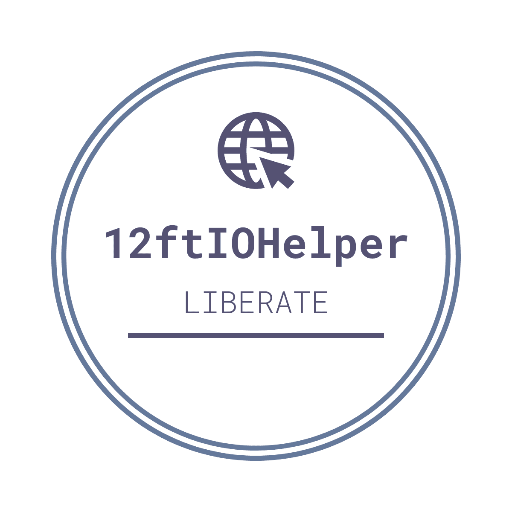

# 12ftIOHelper
## Introduction

  

An UNOFFICIAL chrome extension that helps you visit a website through 12ft.io proxy. 12ft.io is a website that allows you to remove paywalls from websites. For more information, visit https://12ft.io/.
Because microsoft edge is based on chromium, this extension should also work on edge.
## Installation
1. Download the latest release from [here]() and unzip it.
2. Open Chrome and go to `chrome://extensions`.
3. Turn on `Developer mode` on the top right corner.
4. Click `Load unpacked` and select the folder you just unzipped.
5. You should see a new extension called `12ftIOHelper` on the extension list.

Note that steps may vary slightly on edge.
## Usage
### First Method:
1. Click the extension icon on the toolbar.
2. Click `Liberate!` button to visit the current website through 12ft.io proxy.
### Second Method:
Simply click the floating `Liberate!` button on the bottom right corner of the page.
Note that this button can be disabled in the extension page.
## License
This work is under an [MIT](https://choosealicense.com/licenses/mit/) License.